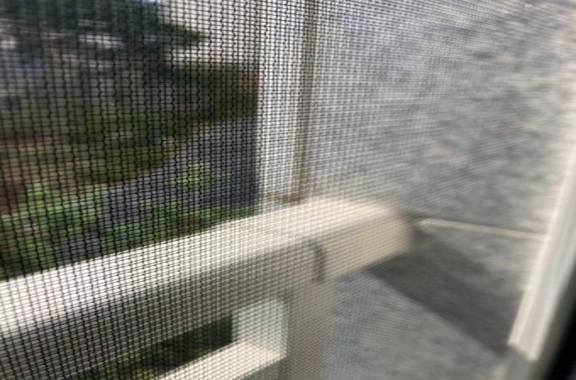
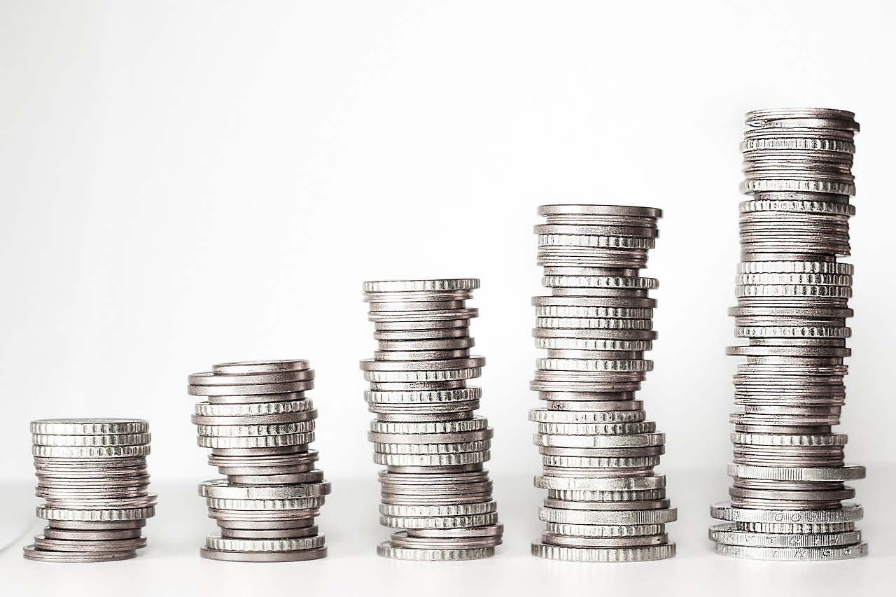

<link rel="preconnect" href="https://fonts.googleapis.com">
<link rel="preconnect" href="https://fonts.gstatic.com" crossorigin>
<link href="https://fonts.googleapis.com/css2?family=Noto+Serif+KR:wght@200;500;700&display=swap" rel="stylesheet">
첫째, 전기세 

스카이캐슬에 설치된 태양광은  
기존 스위트캐슬 태양광보다 더 높은 효율을 자랑합니다.

태양광으로 만들어진 전기는 공용전기 뿐만 아니라 <b>세대전기로 사용가능합니다. </b> 
각 세대마다 태양광 하나가 자기 소유로 넘어가기 때문에 본인이 쓰지않으면 그대로 누적되어 이월됩니다.

<b>이로인해 평균 30만원정도의 전기세를 내던 입주자분은 평균 만원대로 줄어들었다고 합니다.</b>

거실에 달린 시스템에어컨의 난방기능으로 인해 겨울철 가스비용 절감효과도 나타납니다.
이처럼 태양광은 살아갈수록 엄청난 절감효과를 보여줍니다.

 
<link rel="preconnect" href="https://fonts.googleapis.com">
<link rel="preconnect" href="https://fonts.gstatic.com" crossorigin>
<link href="https://fonts.googleapis.com/css2?family=Noto+Serif+KR:wght@200;500;700&display=swap" rel="stylesheet">
둘째, 미세방충망 

스카이캐슬은 집안뿐만 아닌 
<b>복도까지 모두 미세방충망을 사용하였습니다.</b>

일반방충망보다 <b>두배 이상</b>의 효과를 가지고 있어 
여름철 발생할수있는 작은 곤충 벌레를 모두 차단합니다.

 
<link rel="preconnect" href="https://fonts.googleapis.com">
<link rel="preconnect" href="https://fonts.gstatic.com" crossorigin>
<link href="https://fonts.googleapis.com/css2?family=Noto+Serif+KR:wght@200;500;700&display=swap" rel="stylesheet">
셋쨰, 합리적인 가격 

남해는 원룸의 월세가 50만원이 보편적입니다. 
이런 동향을 보시면 스카이캐슬이 더욱 합리적일수밖에 없습니다.

금리에 따라 다르지만 <b>대출 이자로 따졌을때 월세보다 이득</b>이며, 
살아가면서 드는 전기료, 가스료, 관리비 부분에서도 
<b>용량이 더 커진 태양광</b>으로 인해 아주 큰 폭으로 절감되기 때문입니다.

<b>스카이캐슬은 살면 살수록 더욱 가성비 좋은 집입니다!</b>

분양문의 010 5367 8091 이옥선 실장