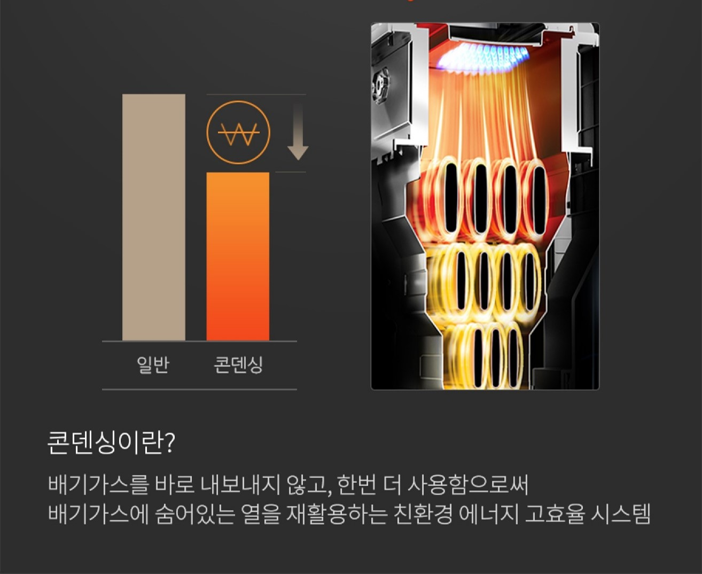
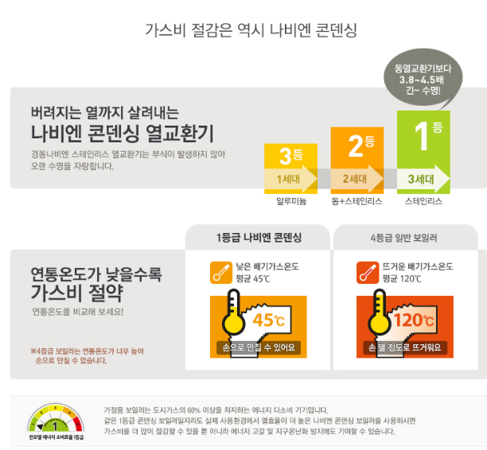
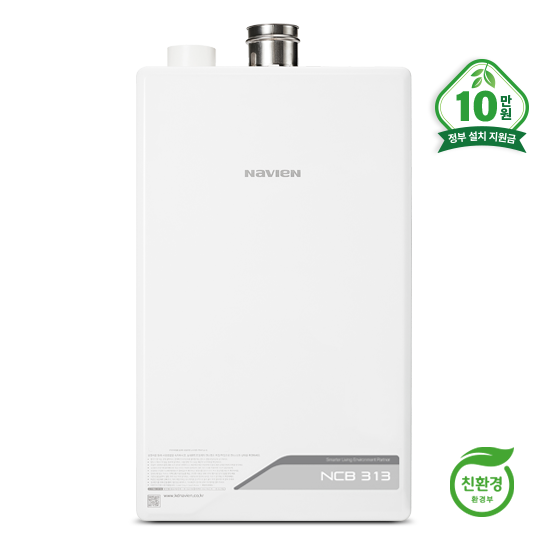
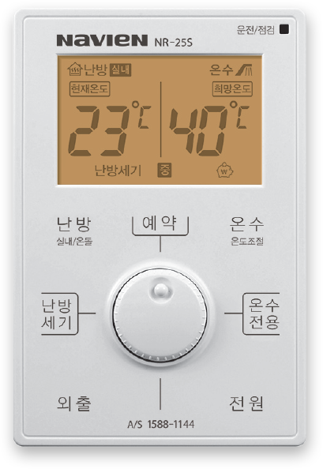

대한민국 최초 프리미엄 콘뎅싱 보일러라고 하면 
가장 대표적인 브랜드가 <b>경동나비엔이죠??</b>

남해 스카이캐슬도 경동나비엔이 각 세개에 모두 설치됩니다

계속해서 말씀드린 스카이캐슬의 가장 큰 장점인 <b>"단열"</b>

가스비 절감 1등 브랜드 나비엔과 
 따뜻하게 짓는 스카이캐슬이 만나 최고의 시너지를 가집니다!

스카이캐슬에서 따뜻하고 시원하고 아늑하게!

<b>유지비는 적게! 생활은 편리하게!</b>

스카이캐슬과 함께 하세요

소비효율 1등급! 경동 나비엔 콘덴싱 보일러

[가정용 보일러는 도시가스 사용의 60% 이상을 차지 하는 에너지 다소비 기기 입니다. 같은 1등급 콘덴싱 보일러지만 실제로 사용환경에서 열효율이 더 높은 나비엔 콘덴셍 보일러를 사용하시면 가스비를 더 많이 절감 할 수 있을 뿐 아니라 에너지 고갈 및 지구온난화 방지에도 기여할 수 있습니다.]

<b>각 방에서 온도 조절 예약까지 가능합니다!</b> 사용하기도 효율적으로 쓰기도 편하겠죠?

저희 스카이캐슬에서 따뜻하고 포근하게 지내시길 바랍니다:)

감사합니다.