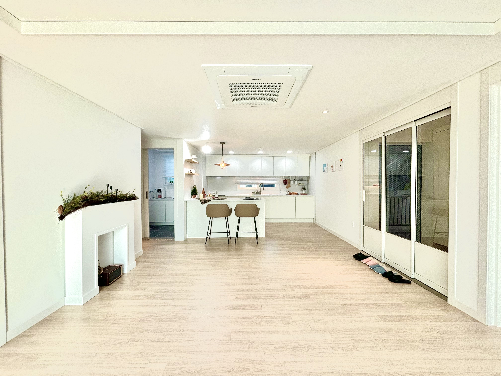
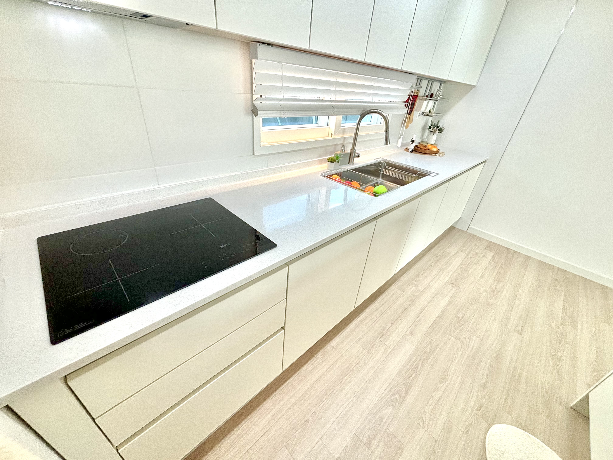
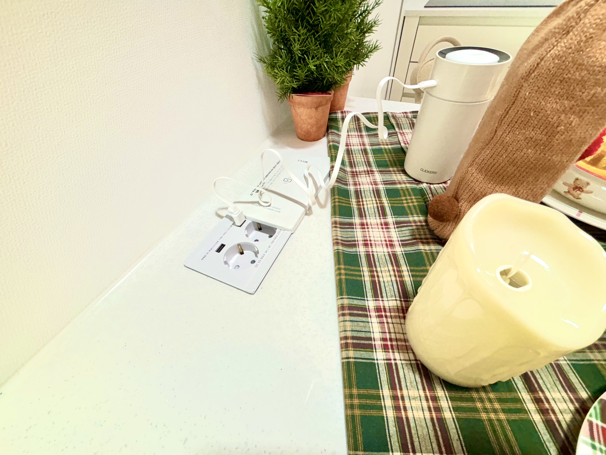
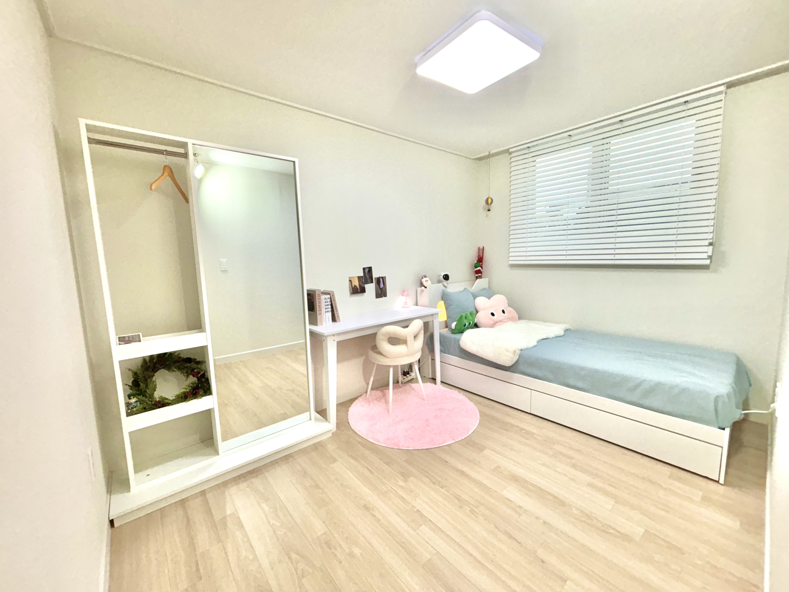
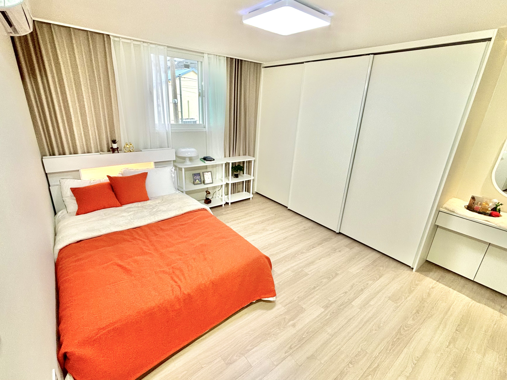
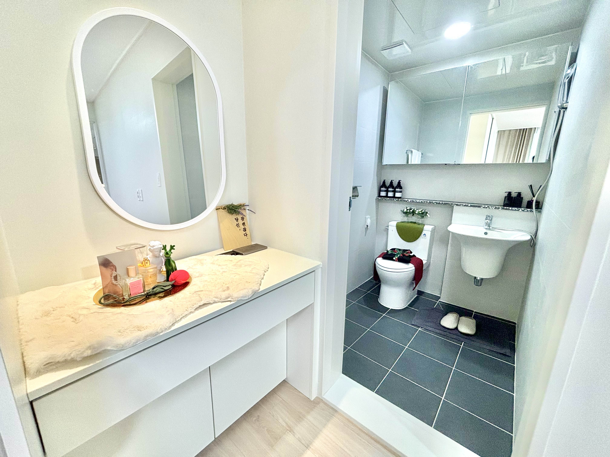
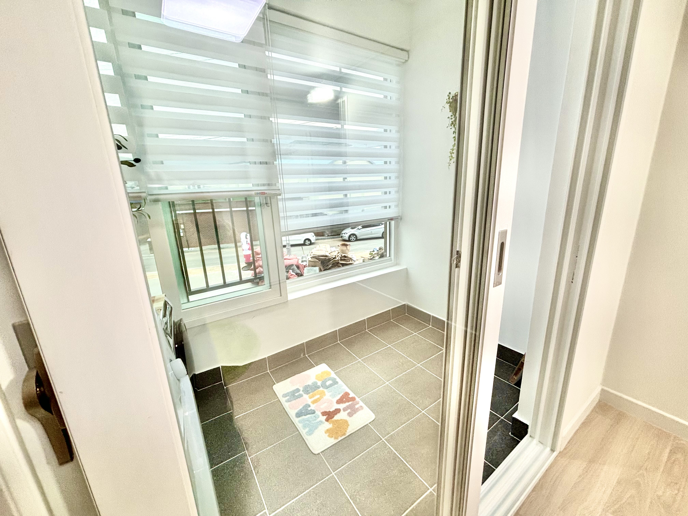
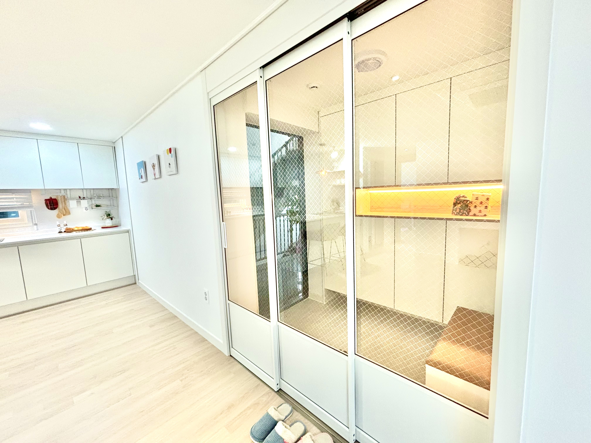

남해 종합버스터미널 앞에 위치한 스카이캐슬입니다! 
16세대에 아주 좋은 조건을 가지고 있으니 서둘러주세요!

5분이내 거리에 하나로 마트, 남해시장이 붙어있으며 
종합버스터미널 옆에 붙어있어 지리적으로 매우 편리합니다. 
또한 중학교 고등학교와 붙어있어 자녀분들 통학시키기에 매우 안전합니다!

총 16세대이며
32평형 방3개 화장실2개로 
 기존 스위트캐슬과 동일한 구조를 가졌지만 조금 더 확장되었다고 생각하시면 됩니다!

오시는 길 : <a href="https://map.naver.com/p/search/%EB%82%A8%ED%95%B4%EC%9D%8D%20%ED%99%94%EC%A0%84%EB%A1%9C%20122%EB%B2%88%EA%B8%B8%2037-26/address/14237519.5837125,4142750.109334,%EA%B2%BD%EC%83%81%EB%82%A8%EB%8F%84%20%EB%82%A8%ED%95%B4%EA%B5%B0%20%EB%82%A8%ED%95%B4%EC%9D%8D%20%ED%99%94%EC%A0%84%EB%A1%9C122%EB%B2%88%EA%B8%B8%2037-26,new?c=19.00,0,0,0,dh&isCorrectAnswer=true">남해읍 화전로 122번길 37-26</a> 

거실-시스템에어컨 포함

주방

아일랜드 식탁 포함

인덕션 및 하이라이터 포함

무선충전 및 콘센트

보조 주방

보조 주방-보조테이블 가스레인지 포함

보조 주방과 작은 주방1

작은방1

안방-벽걸이 에어컨, 붙박이장, 화장대 포함

안방-부부화장실, 화장대, 무선 충전 및 콘센트

작은방2

작은방 베란다

베란다 벽 선반 포함(이동 가능)

거실 화장실

중문

스카이캐슬은  
태양광 / 시스템에어컨 / 벽걸이에어컨 / 붙박이장 / 화장대 / 아이랜드 식탁 / 인덕션 / 하이라이터 / 가스레인지 등 모든 옵션이 분양가에 포함됩니다.

분양가는 2억 2천부터~ 시작하며 가격차이는 오직 전망차이입니다

대출은 70프로까지 가능하며  
금리는 조건에 따라 최대한 낮은 금리에 하실수있게 알선해 드리겠습니다!

남해는 원룸 월세가 50만원이 보편적입니다. 
이러한 요소들을 따졌을때 스카이캐슬은 더욱 합리적일수밖에 없습니다. 
대출 이자로 따졌을때 월세보다 금리가 낮고 
거주하면서 사용하는 전기료, 가스료, 관리비 부분에서
용량이 커진 태양광을 통해 아주 큰 폭으로 절감할 수 있기 때문입니다. 

스카이캐슬은 살면 살수록 가성비 좋은 집이라고 자신합니다!

계약금은 100만원부터 시작합니다. 
아무래도 16세대밖에 없고 오로지 선착순으로 계약되는 점을 고려해 마음에 드는 층수를 빠르게 선점하세요!

분양문의 010 5367 8091 이옥선 실장